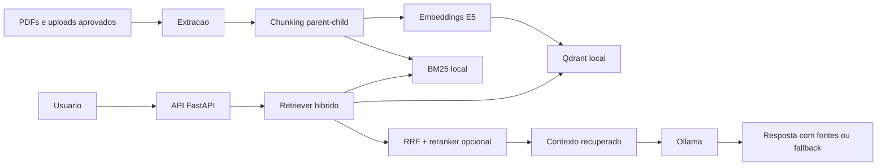
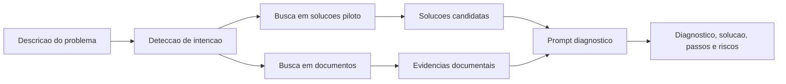

# BBSIA RAG

Backend local de RAG semantico para o Banco Brasileiro de Solucoes de IA
(BBSIA).

O projeto implementa uma API FastAPI para consultar documentos, recuperar
evidencias por busca hibrida, gerar respostas com um modelo local via Ollama e
evoluir para diagnostico de problemas com base em um catalogo curado de
solucoes piloto.

## Visao geral

O BBSIA RAG ajuda equipes a consultar documentos e reutilizar solucoes de IA
com mais rastreabilidade. A aplicacao combina:

- ingestao de PDFs e documentos aprovados;
- extracao estruturada de texto, secoes, tabelas e OCR quando necessario;
- chunks parent-child com metadados de documento, pagina, area e assunto;
- embeddings com SentenceTransformers e armazenamento vetorial no Qdrant local;
- busca hibrida com Qdrant, BM25, Reciprocal Rank Fusion (RRF) e reranker
  opcional;
- respostas em portugues geradas pelo Ollama com fontes recuperadas;
- modo diagnostico para recomendar solucoes do catalogo piloto quando a
  pergunta descreve sintomas, falhas ou problemas.

Para uma explicacao detalhada da pasta `bbsia/`, leia
[documentation/backend-bbsia.md](documentation/backend-bbsia.md).

## Arquitetura



O modo diagnostico usa o catalogo de solucoes como fonte principal e documentos
como evidencias de apoio.



## Estrutura do repositorio

```text
.
|-- bbsia/                  # Pacote Python e backend principal
|   |-- app/                # FastAPI, routers, contratos, runtime e seguranca
|   |-- cli/                # Comandos operacionais
|   |-- core/               # Configuracao e observabilidade
|   |-- domain/             # Catalogo, biblioteca e metadados de documentos
|   |-- evaluation/         # Benchmarks e datasets de avaliacao
|   |-- infrastructure/     # Integracoes tecnicas, como Qdrant
|   `-- rag/                # Ingestao, retrieval, geracao e orquestracao RAG
|-- data/                   # Artefatos gerados e indice local
|-- docs/                   # Documentacao, PDFs de referencia e artefatos HTML
|-- RPI/                    # Especificacoes, design, tarefas e diagnosticos
|-- tests/                  # Testes automatizados
|-- uploads/                # Uploads em quarentena e aprovados
|-- .env.example            # Variaveis de ambiente de referencia
|-- Makefile                # Comandos comuns
|-- pyproject.toml          # Metadados do pacote e ferramentas
`-- requirements.txt        # Dependencias Python
```

## Requisitos

- Python 3.10 ou superior.
- Ollama em execucao local.
- Um modelo Ollama listado em `ALLOWED_LLM_MODELS`.
- Dependencias Python em `requirements.txt`.
- Cache local do modelo de embedding quando `HF_LOCAL_FILES_ONLY=true`.

Dependencias principais:

- `fastapi`
- `uvicorn`
- `sentence-transformers`
- `qdrant-client`
- `pymupdf`
- `docling`
- `jsonschema`
- `prometheus-fastapi-instrumentator`

## Configuracao local

Crie e ative um ambiente virtual:

```powershell
python -m venv .venv
.\.venv\Scripts\Activate.ps1
```

Instale as dependencias:

```powershell
.\.venv\Scripts\pip.exe install -r requirements.txt
```

Copie as variaveis de ambiente de exemplo:

```powershell
Copy-Item .env.example .env
```

Confira se o Ollama esta ativo e se o modelo configurado existe:

```powershell
ollama list
```

Leia [documentation/operacao-local.md](documentation/operacao-local.md) para
detalhes sobre Ollama, embeddings, reranker, upload, reprocessamento e
troubleshooting.

## Execucao

Suba a API local:

```powershell
.\.venv\Scripts\uvicorn.exe bbsia.app.bootstrap.main:app --host 0.0.0.0 --port 8000
```

Ou use o `Makefile`:

```powershell
make run
```

A API fica disponivel em:

```text
http://localhost:8000
```

As interfaces OpenAPI ficam em:

- `http://localhost:8000/docs`
- `http://localhost:8000/redoc`

## Endpoints principais

- `POST /chat`: conversa com o chatbot RAG. A resposta usa streaming NDJSON.
- `POST /search`: busca hibrida nos documentos indexados.
- `GET /areas`: lista areas disponiveis no indice.
- `GET /assuntos`: lista assuntos disponiveis no indice.
- `GET /modelos`: lista modelos Ollama permitidos.
- `GET /rag/health`: mostra o estado do cache RAG.
- `GET /status`: mostra saude da API, Ollama, indice e reprocessamento.
- `GET /biblioteca`: lista documentos da biblioteca com filtros.
- `POST /upload`: envia PDFs para quarentena.
- `GET /admin/quarantine`: lista uploads pendentes de revisao.
- `POST /admin/quarantine/{stored_filename}/approve`: aprova um PDF.
- `POST /reprocessar`: enfileira reprocessamento da base.
- `POST /recarregar`: recarrega recursos RAG em memoria.

Veja exemplos em [documentation/api-reference.md](documentation/api-reference.md).

## Reprocessamento e embeddings

Execute o reprocessamento pela API:

```powershell
make reprocess
```

O pipeline extrai PDFs, gera chunks, calcula embeddings e atualiza o Qdrant
local. O codigo tambem prepara uma colecao separada para solucoes piloto:

```powershell
make solucoes-embedding
```

## Testes e qualidade

Execute a suite de testes:

```powershell
.\.venv\Scripts\python.exe -m pytest
```

Ou use o `Makefile`:

```powershell
make test
make lint
make typecheck
```

## Status do projeto

A base atual ja possui fundamentos funcionais de RAG documental. A evolucao
principal e tornar o catalogo de solucoes um dominio de primeira classe, com
schema proprio, indexacao separada, ranking orientado a problemas, respostas
diagnosticas e criterios de avaliacao mais fortes.

## Documentacao

- [Backend BBSIA](documentation/backend-bbsia.md)
- [Referencia da API](documentation/api-reference.md)
- [Operacao local](documentation/operacao-local.md)
