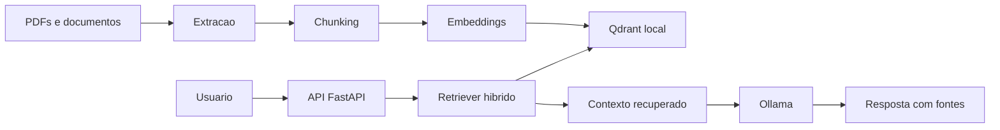
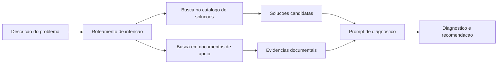

# BBSIA RAG

Backend local de RAG semantico para o Banco Brasileiro de Solucoes de IA (BBSIA).

O projeto implementa uma base de consulta inteligente sobre documentos e prepara a evolucao para um chatbot capaz de diagnosticar problemas e recomendar solucoes estruturadas a partir de um catalogo curado de solucoes piloto.

## Visao Geral

O BBSIA tem como objetivo apoiar a descoberta, reutilizacao e governanca de solucoes de inteligencia artificial no Brasil. A proposta descrita nos materiais da pasta `RPI` combina:

- um banco/catalogo de solucoes de IA;
- busca semantica, textual e facetada;
- recomendacoes baseadas em evidencias;
- infraestrutura local/soberana sempre que possivel;
- integracao futura com fluxos como login gov.br, curadoria e publicacao de solucoes.

Nesta base, o foco principal e o backend de RAG: ingestao de documentos, geracao de embeddings, recuperacao semantica e resposta via modelo local.

## Objetivo do Projeto

A arquitetura atual responde bem ao caso de uso "perguntar aos documentos". A evolucao planejada e transformar o chatbot em uma ferramenta de resolucao de problemas:

1. o usuario descreve sintomas ou um problema tecnico/operacional;
2. o sistema busca solucoes candidatas em um catalogo estruturado;
3. o RAG recupera evidencias documentais de apoio;
4. o LLM gera uma resposta com diagnostico, solucao recomendada, passos, riscos e restricoes;
5. se nao houver solucao confiavel no catalogo, o sistema deve responder de forma conservadora, sem inventar recomendacoes.

## Arquitetura

Componentes principais:

- **FastAPI**: API HTTP, endpoints de chat, busca e administracao.
- **Qdrant local**: armazenamento vetorial dos chunks.
- **SentenceTransformers / E5**: geracao de embeddings multilingues.
- **BM25 + RRF + reranking opcional**: recuperacao hibrida para combinar busca semantica e lexical.
- **Ollama**: geracao local das respostas.
- **Catalogo de solucoes piloto**: dominio estruturado em evolucao para recomendacao de solucoes.

Fluxo simplificado:



Evolucao planejada para problemas e solucoes:



## Estrutura do Repositorio

```text
.
|-- bbsia/
|   |-- app/
|   |   |-- bootstrap/             # Ponto de entrada FastAPI
|   |   |-- contracts/             # Schemas Pydantic da API
|   |   |-- routers/               # Endpoints HTTP
|   |   |-- runtime/               # App, estado, auditoria e reprocessamento
|   |   |-- security/              # Autenticacao e rate limit
|   |   `-- uploads_service/       # Upload, quarentena e validacao de PDFs
|   |-- cli/                       # Comandos operacionais
|   |-- core/                      # Configuracao e recursos compartilhados
|   |-- domain/catalogo/           # Catalogo, schema e validacao de solucoes
|   |-- evaluation/benchmarks/     # Benchmarks, datasets e resultados
|   |-- infrastructure/            # Integracoes tecnicas, como Qdrant
|   `-- rag/
|       |-- generation/            # Prompts, Ollama e faithfulness
|       |-- ingestion/             # Extracao, chunking e embeddings
|       |-- orchestration/         # Pipeline RAG
|       |-- public_api/            # Fachada interna do motor RAG
|       `-- retrieval/             # Busca hibrida, reranker e query planning
|-- data/                          # Dados extraidos, chunks, metadados e indice local
|-- tests/                         # Testes automatizados
|-- uploads/                       # Arquivos enviados e aprovados em runtime
`-- RPI/                           # Especificacoes, diagnostico e materiais de planejamento
```

## Requisitos

- Python 3.10 ou superior
- Ollama em execucao local
- Modelo de LLM disponivel no Ollama
- Dependencias Python listadas em `requirements.txt`

Dependencias principais:

- `fastapi`
- `uvicorn`
- `sentence-transformers`
- `qdrant-client`
- `pymupdf`
- `docling`
- `jsonschema`
- `prometheus-fastapi-instrumentator`

## Configuracao Local

Crie e ative um ambiente virtual:

```powershell
python -m venv .venv
.\.venv\Scripts\Activate.ps1
```

Instale as dependencias:

```powershell
.\.venv\Scripts\pip.exe install -r requirements.txt
```

Copie o exemplo de variaveis de ambiente, se necessario:

```powershell
Copy-Item .env.example .env
```

Garanta que o Ollama esteja ativo e que o modelo configurado esteja disponivel:

```powershell
ollama list
```

## Execucao

Suba a API local:

```powershell
.\.venv\Scripts\uvicorn.exe bbsia.app.bootstrap.main:app --host 0.0.0.0 --port 8000
```

Ou use o alvo do `Makefile`:

```powershell
make run
```

A API ficara disponivel em:

```text
http://localhost:8000
```

## Endpoints Principais

- `POST /chat`: conversa com o chatbot RAG.
- `POST /chat/stream`: resposta em streaming, quando habilitada.
- `GET /search`: busca semantica/textual nos documentos indexados.
- `POST /reprocessar`: reprocessa documentos e atualiza a base vetorial.
- Endpoints administrativos e de biblioteca ficam organizados em `bbsia/app/routers/`.

## Reprocessamento e Embeddings

O fluxo de reprocessamento extrai documentos, gera chunks, calcula embeddings e atualiza o indice local.

```powershell
make reprocess
```

Para o dominio de solucoes piloto, existe um plano de evolucao para manter colecoes separadas no Qdrant, evitando que a ingestao de solucoes sobrescreva o indice documental principal.

## Testes e Qualidade

Execute a suite de testes:

```powershell
.\.venv\Scripts\python.exe -m pytest
```

Com `Makefile`:

```powershell
make test
```

Verificacoes auxiliares:

```powershell
make lint
make typecheck
```

## Roadmap Tecnico

Com base nos documentos `SPEC.md`, `DESIGN.md`, `TASKS.md` e no diagnostico da pasta `RPI`, os proximos passos principais sao:

1. Expandir o schema de `solucao_piloto` com sintomas, causa raiz, pre-condicoes, passos, riscos e restricoes.
2. Consolidar `bbsia/domain/catalogo/data/solucoes_piloto.json` como fonte curada de solucoes.
3. Separar a indexacao de documentos e solucoes em colecoes/indices distintos.
4. Parametrizar o retriever para consultar documentos, solucoes ou ambos.
5. Refatorar o pipeline para detectar intencao de diagnostico.
6. Ajustar prompts para respostas estruturadas e conservadoras.
7. Ampliar testes e benchmarks com perguntas de problema e solucoes esperadas.

## Principios de Resposta

O chatbot deve:

- responder em portugues;
- usar somente evidencias recuperadas;
- citar fontes quando aplicavel;
- diferenciar evidencias documentais de solucoes candidatas;
- evitar recomendacoes inventadas;
- pedir mais informacoes quando o problema estiver subespecificado;
- retornar um fallback seguro quando nao houver solucao validada no catalogo.

## Status

A base atual ja possui fundamentos funcionais de RAG documental. A principal evolucao arquitetural em aberto e tornar o catalogo de solucoes um dominio de primeira classe, com schema proprio, indexacao separada, ranking orientado a problemas e contrato de resposta estruturado.
