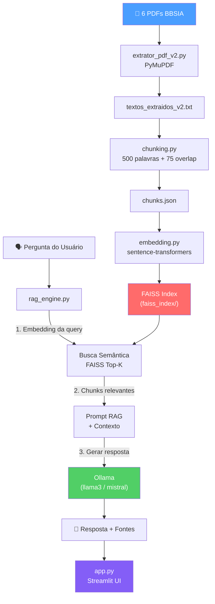

# 🤖 Plano de Criação — Chatbot RAG BBSIA

> **Última atualização:** 23/04/2026
> **Stack definida:** Ollama (local) + FAISS + Sentence-Transformers + Streamlit
> **Dataset NICE:** Excluído da base de conhecimento

---

## Visão Geral da Arquitetura RAG



---

## Decisões Técnicas

### FAISS — Análise e Recomendação

> [!NOTE]
> **FAISS é uma boa escolha para este projeto.** Aqui está o porquê:

| Critério | FAISS | ChromaDB |
|---|---|---|
| **Velocidade** | ⚡ Extremamente rápido (C++ nativo) | Bom, mas mais lento |
| **Escala** | Milhões de vetores sem problema | Limitado a centenas de milhares |
| **Dependência** | `faiss-cpu` (leve, sem servidor) | Precisa de servidor persistente |
| **Filtragem nativa** | ❌ Não tem — precisa implementar | ✅ Built-in `where` clauses |
| **Maturidade** | Meta (Facebook) — battle-tested | Mais recente, comunidade menor |
| **Offline** | ✅ 100% local | ✅ 100% local |

**Estratégia para o filtro no FAISS:** Vamos manter um `metadata.json` paralelo ao índice. Na hora da busca, primeiro filtramos os IDs elegíveis (por documento, assunto, área) e depois fazemos a busca vetorial apenas nesse subconjunto. FAISS suporta isso nativamente com `IDSelectorArray`.

### Ollama — Modelo local

| Modelo | Tamanho | Velocidade | Qualidade PT-BR |
|---|---|---|---|
| `qwen3.5:7b-instruct` | conforme tag local | Rápido | Boa |
| `mistral:7b` | ~4.1 GB | Muito rápido | Boa |
| `qwen3.5:maior-contexto` | conforme tag local | Lento (precisa GPU forte) | Excelente |
| `gemma2:9b` | ~5.4 GB | Rápido | Boa |

**Recomendação:** Começar com `qwen3.5:7b-instruct` — modelo padrão definido para inferência local via Ollama.

---

## Requisitos do Chatbot

### Requisitos Funcionais

| # | Requisito | Fase | Prioridade |
|---|---|---|---|
| RF-01 | Sistema de busca semântica (FAISS + embeddings) | 3-4 | 🔴 Alta |
| RF-02 | Escolha de modelo para busca (dropdown Ollama) | 4 | 🟡 Média |
| RF-03 | Sistema de filtros: assuntos gerais, áreas específicas | 4-5 | 🔴 Alta |
| RF-04 | Adicionar arquivos e links à base de conhecimento | 5 | 🟡 Média |
| RF-05 | Histórico de conversas (persistente por sessão) | 5 | 🔴 Alta |
| RF-06 | Escolha de tema (escuro/claro) | 5 | 🟢 Baixa |

### Requisitos Não-Funcionais

| # | Requisito | Critério |
|---|---|---|
| RNF-01 | Resposta em < 5 segundos | Latência |
| RNF-02 | 100% offline (sem APIs externas) | Privacidade |
| RNF-03 | Rastreabilidade das fontes | Transparência |
| RNF-04 | Interface responsiva | Usabilidade |

---

## Fases de Desenvolvimento

### ✅ Fase 1 — Extração de Texto (CONCLUÍDA)

**Arquivo:** `extrator_pdf_v2.py` (PyMuPDF)

- [x] Leitura dos 6 PDFs do BBSIA com PyMuPDF
- [x] Texto limpo, sem fragmentação palavra-por-palavra
- [x] 76 páginas extraídas, 118K caracteres
- [x] Dataset NICE.xlsx **excluído** da base

**Resultado da extração v2:**
```
PDFs processados  : 6
Total de páginas  : 76
Total de caracteres: 118,119
```

---

### 🔲 Fase 2 — Chunking (ATUALIZAR)

**Arquivo:** `chunking.py` → **precisa apontar para `textos_extraidos_v2.txt`**

- [x] Limpeza de texto fragmentado (join de linhas)
- [x] Divisão em chunks de 500 palavras com 75 de overlap
- [x] Quebra em limite de frases
- [x] Metadados: `id`, `documento`, `pagina`, `chunk_index`, `num_palavras`

**Pendências:**
- [ ] Atualizar `INPUT_FILE` para `textos_extraidos_v2.txt`
- [ ] Adicionar campo `assunto` / `area` nos metadados (para RF-03: filtros)
- [ ] Rodar e validar chunks com a nova extração

**Categorias de filtro a adicionar nos metadados:**
```python
CATEGORIAS_DOCUMENTOS = {
    "Bases para Chatbot BBSIA e RAG.pdf": {
        "area": "arquitetura",
        "assuntos": ["RAG", "chatbot", "bases de dados", "governança"]
    },
    "LIIA - InovaLabs 2026 Dinâmica.pdf": {
        "area": "metodologia",
        "assuntos": ["oficina", "frameworks", "inovação"]
    },
    "LIIA BBSIA - Fase 1 MVP...pdf": {
        "area": "desenvolvimento",
        "assuntos": ["MVP", "backend", "API", "cronograma"]
    },
    "LIIA BBSIA - Framework de Prontidão em IA.pdf": {
        "area": "governança",
        "assuntos": ["maturidade", "prontidão", "avaliação"]
    },
    "LIIA BBSIA - Framework Ética em IA MGI.pdf": {
        "area": "ética",
        "assuntos": ["ética", "LGPD", "conformidade", "regulação"]
    },
    "LIIA BBSIA - Infra-estrutura.pdf": {
        "area": "infraestrutura",
        "assuntos": ["servidores", "nuvem", "kubernetes", "segurança"]
    },
}
```

---

### 🔲 Fase 3 — Embedding + FAISS

**Arquivo a criar:** `embedding.py`

**Objetivo:** Gerar vetores de cada chunk e criar o índice FAISS persistente.

**Componentes:**
1. Carregar `chunks.json`
2. Modelo: `intfloat/multilingual-e5-large` (multilíngue, 1024 dimensões)
3. Gerar embeddings em batch
4. Criar índice FAISS (`IndexFlatIP` para cosine similarity)
5. Salvar: `faiss_index/index.faiss` + `faiss_index/metadata.json`

**Código planejado:**
```python
import faiss
import json
import numpy as np
from sentence_transformers import SentenceTransformer

MODEL_NAME = "intfloat/multilingual-e5-large"
CHUNKS_FILE = "chunks.json"
INDEX_DIR = "faiss_index"

def run_embedding():
    with open(CHUNKS_FILE, "r", encoding="utf-8") as f:
        chunks = json.load(f)
    
    model = SentenceTransformer(MODEL_NAME)
    texts = [c["texto"] for c in chunks]
    
    print(f"Gerando embeddings para {len(texts)} chunks...")
    embeddings = model.encode(texts, show_progress_bar=True, normalize_embeddings=True)
    
    # Índice FAISS com Inner Product (equivale a cosine sim com vetores normalizados)
    dim = embeddings.shape[1]
    index = faiss.IndexFlatIP(dim)
    index.add(embeddings.astype(np.float32))
    
    os.makedirs(INDEX_DIR, exist_ok=True)
    faiss.write_index(index, f"{INDEX_DIR}/index.faiss")
    
    # Metadados (para filtros e rastreabilidade)
    with open(f"{INDEX_DIR}/metadata.json", "w", encoding="utf-8") as f:
        json.dump(chunks, f, ensure_ascii=False, indent=2)
    
    print(f"Índice FAISS salvo: {len(texts)} vetores, dim={dim}")
```

**Dependências:**
```bash
pip install sentence-transformers faiss-cpu numpy
```

---

### 🔲 Fase 4 — Motor RAG (Retriever + LLM)

**Arquivo a criar:** `rag_engine.py`

**Componentes:**

#### 4a. Retriever com filtros
```python
def search(query, top_k=5, filtro_area=None, filtro_assunto=None):
    # 1. Gera embedding da query
    # 2. Se há filtro, seleciona IDs elegíveis
    # 3. Busca FAISS com IDSelectorArray (se filtrado) ou busca geral
    # 4. Retorna chunks + scores + metadados
```

#### 4b. Prompt Template
```
Você é um assistente especializado do projeto BBSIA (Banco Brasileiro de Soluções de IA).

REGRAS:
- Responda APENAS com base nos documentos fornecidos abaixo.
- Se a informação não estiver nos documentos, diga claramente que não encontrou.
- Cite a fonte (documento e página) ao final de cada afirmação.
- Responda em português brasileiro formal.

--- DOCUMENTOS RECUPERADOS ---
{contexto}

--- PERGUNTA ---
{pergunta}

--- RESPOSTA ---
```

#### 4c. Integração Ollama
```python
import requests

def query_ollama(prompt, model="qwen3.5:7b-instruct"):
    response = requests.post("http://localhost:11434/api/generate", json={
        "model": model,
        "prompt": prompt,
        "stream": False,
        "options": {"temperature": 0.3, "top_p": 0.9}
    })
    return response.json()["response"]
```

#### 4d. Escolha de modelo (RF-02)
```python
def list_ollama_models():
    """Lista modelos disponíveis no Ollama local."""
    response = requests.get("http://localhost:11434/api/tags")
    return [m["name"] for m in response.json()["models"]]
```

---

### 🔲 Fase 5 — Interface Streamlit

**Arquivo a criar:** `app.py`

**Layout planejado:**

```
┌──────────────────────────────────────────────────┐
│  🤖 BBSIA Chatbot                    [🌙/☀️]    │
├──────────┬───────────────────────────────────────┤
│          │                                       │
│ FILTROS  │   Área de Chat                        │
│          │                                       │
│ [Área]   │   👤 Pergunta do usuário              │
│ [Assunto]│   🤖 Resposta com fontes              │
│ [Modelo] │                                       │
│          │   📎 Fontes consultadas:              │
│ ───────  │     - Doc X, Pág Y                    │
│ UPLOAD   │     - Doc Z, Pág W                    │
│ [📁 PDF] │                                       │
│ [🔗 Link]│                                       │
│          │                                       │
│ ───────  │   ┌──────────────────────┐            │
│ HISTÓRICO│   │ Digite sua pergunta  │ [Enviar]   │
│ [Chat 1] │   └──────────────────────┘            │
│ [Chat 2] │                                       │
└──────────┴───────────────────────────────────────┘
```

**Funcionalidades por requisito:**

| Requisito | Implementação Streamlit |
|---|---|
| RF-01 Busca semântica | `rag_engine.search()` no backend |
| RF-02 Escolha de modelo | `st.selectbox()` com `list_ollama_models()` |
| RF-03 Filtros | `st.sidebar` com multiselect por área/assunto |
| RF-04 Upload de arquivos | `st.file_uploader()` + reprocessamento em tempo real |
| RF-05 Histórico | `st.session_state` + serialização em JSON |
| RF-06 Tema escuro/claro | CSS custom com toggle no header |

---

## Estrutura Final de Arquivos

```
BBSIA/
├── 📄 6 PDFs (base de conhecimento)
│
├── extrator_pdf_v2.py      ✅ Fase 1 — Concluído
├── textos_extraidos_v2.txt  ✅ Gerado (118K chars, 76 pags)
│
├── chunking.py             🔲 Fase 2 — Atualizar input
├── chunks.json             🔲 A gerar
│
├── embedding.py            🔲 Fase 3 — A criar
├── faiss_index/            🔲 Fase 3 — Gerado pelo embedding.py
│   ├── index.faiss
│   └── metadata.json
│
├── rag_engine.py           🔲 Fase 4 — A criar
│
├── app.py                  🔲 Fase 5 — A criar
├── styles/                 🔲 Fase 5 — CSS temas claro/escuro
│
├── uploads/                🔲 Fase 5 — PDFs adicionados pelo usuário
├── historico/              🔲 Fase 5 — Histórico de conversas
│
├── requirements.txt        🔲 A criar
└── .venv/                  ✅ Ambiente virtual
```

---

## Roadmap de Execução

```
Semana 1
  ├── [x] Extração v2 com PyMuPDF (CONCLUÍDO)
  ├── [ ] Atualizar chunking.py para v2 + metadados de filtro
  ├── [ ] Rodar e validar chunks
  └── [ ] Criar embedding.py + índice FAISS

Semana 2
  ├── [ ] Instalar Ollama + baixar qwen3.5:7b-instruct
  ├── [ ] Criar rag_engine.py (retriever + LLM + filtros)
  ├── [ ] Testar com 15+ perguntas reais do BBSIA
  └── [ ] Ajustar prompt e parâmetros

Semana 3
  ├── [ ] Criar app.py (Streamlit) com layout completo
  ├── [ ] Implementar tema escuro/claro
  ├── [ ] Implementar upload de novos documentos
  ├── [ ] Implementar histórico de conversas
  └── [ ] Testes de integração e polish
```

---

## Dependências Completas

```
# requirements.txt
pymupdf>=1.27.0
sentence-transformers>=3.0.0
faiss-cpu>=1.8.0
numpy>=1.26.0
streamlit>=1.40.0
requests>=2.31.0
```

---

> [!IMPORTANT]
> **Próximo passo imediato:**
> 1. Atualizar `chunking.py` para ler `textos_extraidos_v2.txt` e adicionar metadados de área/assunto
> 2. Rodar o chunking e validar
> 3. Criar `embedding.py` com FAISS
